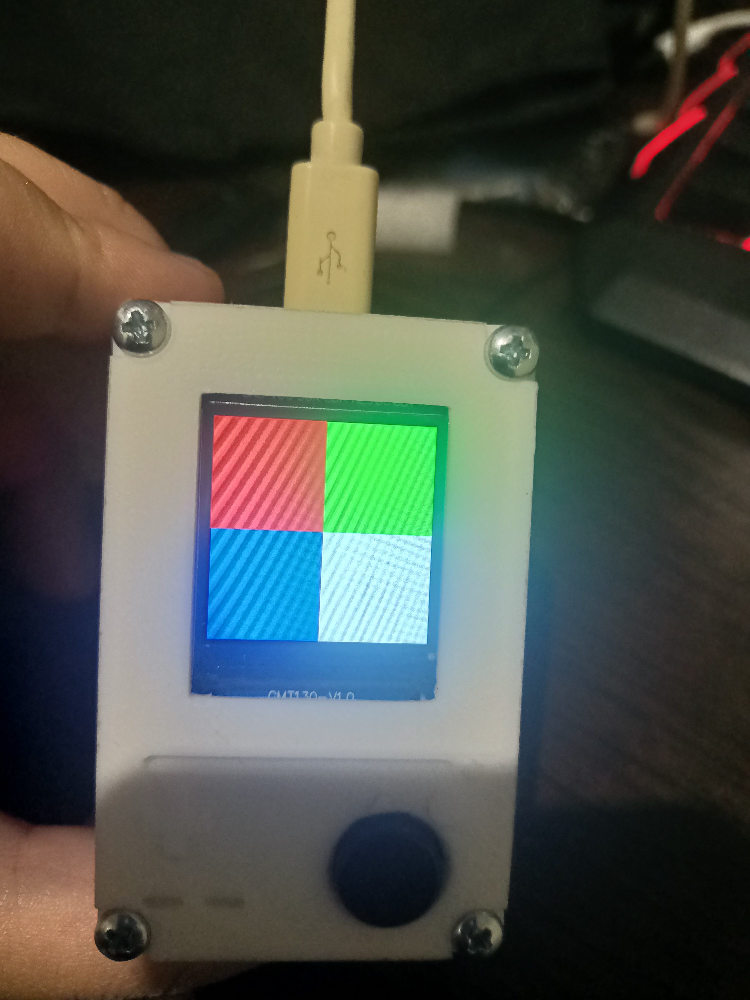

# ESP32 GIF Oynatıcı

ESP32 kullanarak SD kartta depolanan GIF animasyonlarını oynatan ve butona basıldığında sıradaki GIF'e geçiş yapan bir proje.

 **[YouTube'da İzle](https://youtube.com/shorts/fSTFpnymG3Y)**

---

##  Yapım Fotoğrafları

  
  

---

##  Çalışma Mantığı

ESP32, SD karttaki GIF dosyalarını belirli bir formatta okuyarak [AnimatedGIF](https://github.com/bitbank2/AnimatedGIF) kütüphanesi yardımıyla TFT ekranda oynatıyor. Butona her basıldığında sıradaki GIF'e geçiş yapılıyor.

GIF dosyalarınızı gerekli formata dönüştürmek için repodaki `convert_last.py` scriptini kullanabilirsiniz. Dönüştürülen dosyaları SD karta attığınızda ESP32 otomatik olarak algılayıp oynatacaktır.

---

##  Bağlantı Şeması / Pin Yapılandırması

### SD Kart Modülü

| SD Kart | ESP32 |
|---------|-------|
| CS      | 5     |
| SCK     | 14    |
| MOSI    | 13    |
| MISO    | 19    |
| VCC     | 5V    |
| GND     | GND   |

### TFT Ekran

| TFT  | ESP32 |
|------|-------|
| GND  | GND   |
| VCC  | 3.3V  |
| SCK  | 18    |
| SDA  | 23    |
| RES  | 4     |
| DC   | 2     |

### Buton

| Buton | ESP32 |
|-------|-------|
| PIN   | 15    |

---

##  Repo İçeriği

- **`esp32_gif_player.ino`** — ESP32 için ana Arduino kodu
- **`convert_last.py`** — GIF'leri gerekli formata dönüştüren Python scripti
- **`fusion/`** — Kutu tasarımı için Fusion 360 dosyaları
- **`images/`** — Yapım aşaması fotoğrafları

---

##  Nasıl Kullanılır?

1. Bu repoyu klonlayın
2. GIF dosyalarınızı `convert_last.py` ile dönüştürüp SD karta kopyalayın
3. Bileşenleri yukarıdaki tabloya göre bağlayın
4. `esp32_gif_player.ino` dosyasını Arduino IDE üzerinden ESP32'ye yükleyin
5. Açın ve keyfini çıkarın!

---

##  Gerekli Kütüphaneler

- [AnimatedGIF](https://github.com/bitbank2/AnimatedGIF) — Larry Bank
- TFT_eSPI veya uyumlu bir TFT kütüphanesi

---

##  Önemli Notlar

> **TFT Renk Formatı:** Bazı TFT ekranlar üretimden kaynaklı olarak standart RGB yerine BGR veya GRB gibi farklı renk sıraları kullanabiliyor. Renkler hatalı görünüyorsa kodda renk formatını düzeltmeniz gerekebilir — bu düzeltmeler için yapay zeka araçlarından yardım alabilirsiniz.

> **Kod Stabilitesi:** Bu proje yaklaşık 4–5 ay önce yapıldı ve tam olarak dokümante edilemedi. Kodda küçük hatalar veya eski kütüphane versiyonları olabilir. Issue açmaktan veya pull request göndermekten çekinmeyin.

> **Kutu Tasarımı (Fusion 360):** Mevcut tasarımda USB Type-C çıkışı biraz dar kalmış. Eğer kutuyu basmayı planlıyorsanız bu alanı genişlettikten sonra dilimleyin.

> **Devre Kurulumu:** Devre delikli plaket (perfboard) üzerine kurulmuştur, özel PCB gerekmemektedir.

---

##  Lisans

Bu proje açık kaynaklıdır. Kullanmakta, değiştirmekte ve paylaşmakta özgürsünüz.

---
---

#  ESP32 GIF Player

An ESP32-based project that plays GIF animations stored on an SD card and cycles to the next GIF with a button press.

📺 **[Watch on YouTube](https://youtube.com/shorts/fSTFpnymG3Y)**

---

##  Build Photos

  
  

---

##  How It Works

The ESP32 reads GIF files from the SD card in a specific format and renders them on a TFT display using the [AnimatedGIF](https://github.com/bitbank2/AnimatedGIF) library. Each button press advances to the next GIF in the sequence.

To convert your GIFs into the required format, use the included `convert_last.py` script, then copy the output files to your SD card. The ESP32 will automatically detect and play them.

---

##  Wiring / Pin Configuration

### SD Card Module

| SD Card | ESP32 |
|---------|-------|
| CS      | 5     |
| SCK     | 14    |
| MOSI    | 13    |
| MISO    | 19    |
| VCC     | 5V    |
| GND     | GND   |

### TFT Display

| TFT  | ESP32 |
|------|-------|
| GND  | GND   |
| VCC  | 3.3V  |
| SCK  | 18    |
| SDA  | 23    |
| RES  | 4     |
| DC   | 2     |

### Button

| Button | ESP32 |
|--------|-------|
| PIN    | 15    |

---

##  Repository Contents

- **`esp32_gif_player.ino`** — Main Arduino sketch for the ESP32
- **`convert_last.py`** — Python script to convert GIFs into the required format
- **`fusion/`** — Fusion 360 design files for the enclosure
- **`images/`** — Build photos

---

##  Getting Started

1. Clone this repository
2. Convert your GIF files using `convert_last.py` and copy them to the SD card
3. Wire up the components as shown in the table above
4. Upload `esp32_gif_player.ino` to your ESP32 via Arduino IDE
5. Power on and enjoy!

---

##  Dependencies

- [AnimatedGIF](https://github.com/bitbank2/AnimatedGIF) by Larry Bank
- TFT_eSPI or compatible TFT library

---

##  Important Notes

> **TFT Color Format:** Some TFT displays use BGR or GRB color ordering instead of standard RGB due to manufacturing differences. If colors appear incorrect, you may need to adjust the color format in the code — AI tools can help identify and fix this.

> **Code Stability:** This project was built ~4–5 months ago and hasn't been fully documented since. There may be minor bugs or outdated library versions in the code. Feel free to open an issue or submit a pull request.

> **Enclosure (Fusion 360):** The USB Type-C port opening in the current design is slightly narrow. If you plan to print the enclosure, widen this gap before slicing.

> **Build Method:** The circuit was assembled on a perfboard. No custom PCB is required.

---

##  License

This project is open source. Feel free to use, modify, and share.
